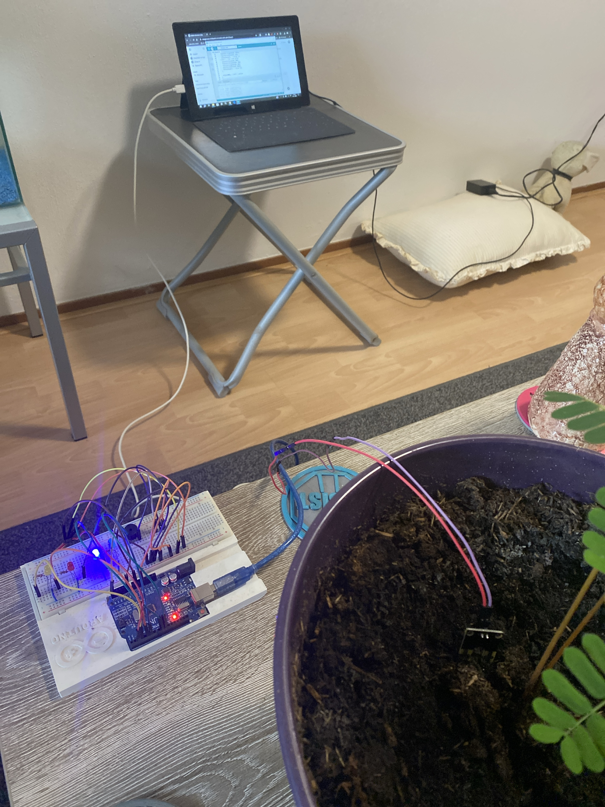

# 🌱 Soil Moisture Sensor with Arduino



> A fun and functional project to monitor soil moisture levels using an Arduino, complete with LEDs and a buzzer! This project is perfect for plant enthusiasts and tech lovers alike. 🌿

## 📋 Features
- 🚦 **Visual Indicators:** LED lights to indicate moisture levels:
  - 🟥 Red: Dry soil (needs water).
  - 🟨 Yellow: Moderate moisture.
  - 🟩 Green: Optimal moisture.
  - 🟦 Blue: Overwatered soil.
- 🔊 **Buzzer Alert:** Audible alarm for dry soil.
- 📟 **Live Monitoring:** View real-time data via the Arduino Serial Monitor.

## 🛠️ Requirements
- Arduino Uno (or compatible)
- YL-69 Soil Moisture Sensor + Interface Module
- Breadboard and jumper wires
- LEDs (Red, Yellow, Green, Blue)
- Buzzer
- Resistors (220 Ohm for LEDs)
- USB cable and Arduino IDE

## 🔌 Connecting the Pins
### 1. **Soil Moisture Sensor to Interface Module:**
- Connect the two pins from the YL-69 soil sensor to the interface module.

### 2. **Interface Module to Arduino:**
- **VCC** (on the module) → Arduino 5V
- **GND** (on the module) → Arduino GND
- **A0** (on the module) → Arduino A0 (for analog readings)
- **D0** (on the module) → Arduino D2 (for digital threshold alerts)

### 3. **LEDs to Arduino:**
- Connect the LEDs to their respective digital pins:
  - 🟥 **Red LED** → Arduino D5
  - 🟨 **Yellow LED** → Arduino D3
  - 🟩 **Green LED** → Arduino D9
  - 🟦 **Blue LED** → Arduino D6
- Connect the cathode (short pin) of each LED to GND through a 220 Ohm resistor.

### 4. **Buzzer to Arduino:**
- Connect the buzzer to Arduino D10 (signal pin) and GND.

## 🚀 Getting Started
### 1. Clone the Repository
```bash
git clone https://github.com/<your-username>/soil_Sensor_Arduino.git
```

### 2. Upload the Code
1. Open the code in the Arduino IDE.
2. Select the correct board and COM port.
3. Upload the code to your Arduino.

### 3. Assemble the Circuit
Follow the pin connections as described above and refer to the schematic diagram provided in the repository.

### 4. Monitor the Data
Open the Serial Monitor in the Arduino IDE (set to 9600 baud) to view real-time readings.

## 📂 File Structure
```
soil-moisture-sensor/
├── README.md         # Project documentation
├── LICENSE           # MIT License
├── soil_sensor.jpeg   # Image of the soil sensor setup
├── code/             # Arduino code
└── schematics/       # Circuit diagrams
```

## 🎨 Visual Indicators
| LED  | Moisture Level       |
|------|----------------------|
| 🟥 Red   | Dry soil (> 700)      |
| 🟨 Yellow| Moderate (500-700)    |
| 🟩 Green | Optimal (300-500)     |
| 🟦 Blue  | Overwatered (< 300)   |

## 🤝 Contributing
Feel free to fork this repository and contribute! Whether it's fixing a bug, adding features, or improving documentation, all contributions are welcome.

## 📝 License
This project is licensed under the [MIT License](./LICENSE) - see the LICENSE file for details.

---

💻 **Happy Coding!** 🌟 If you enjoy this project, don't forget to give it a ⭐ on GitHub!
